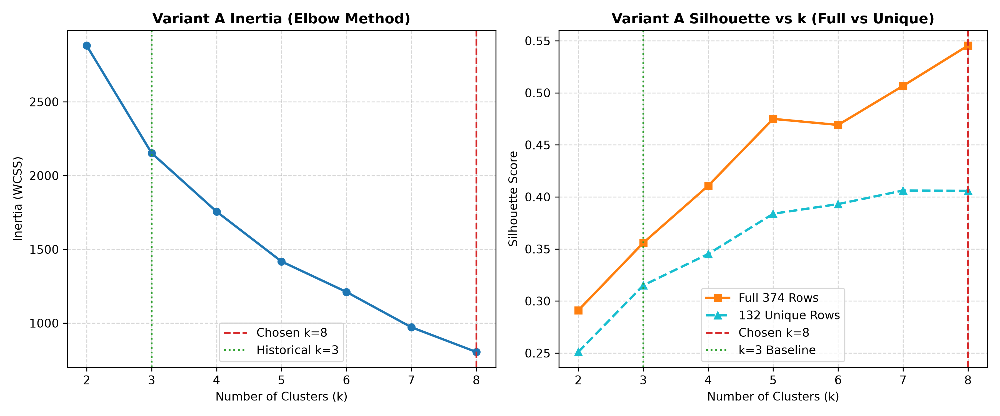
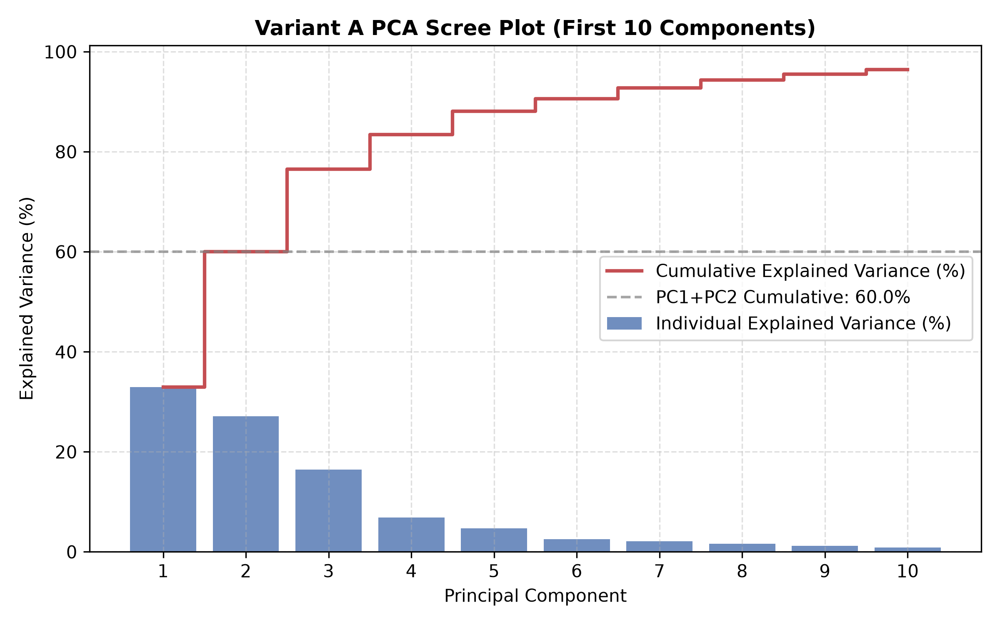
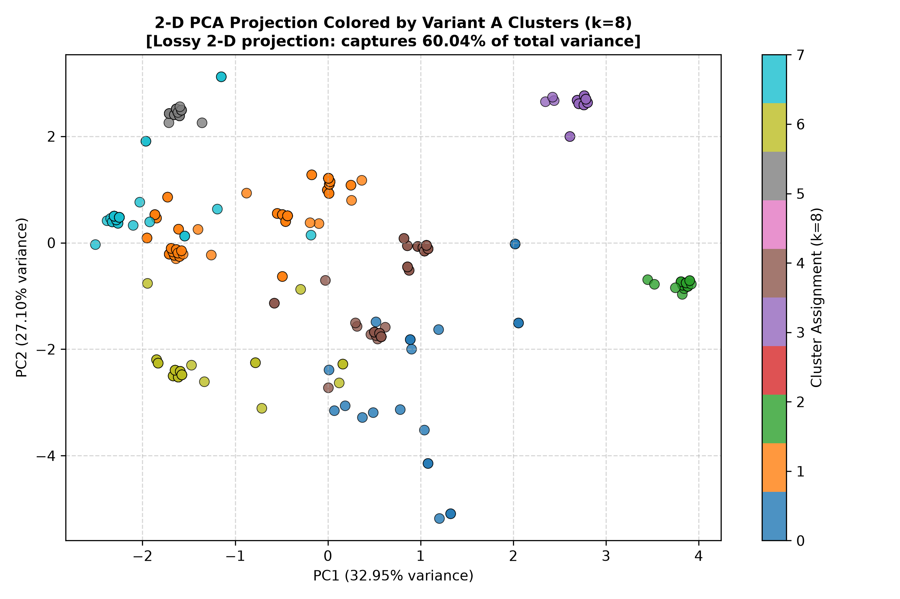
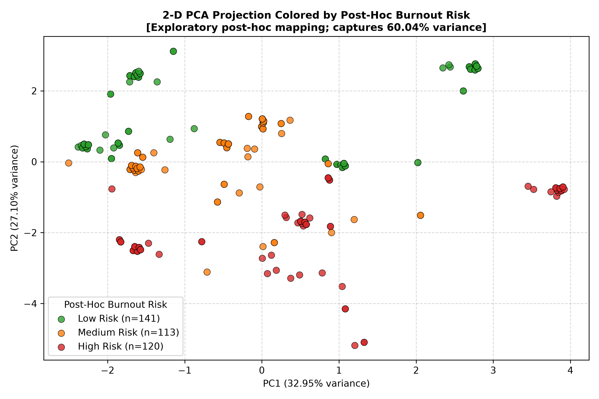

# BurnoutLens Phase 4 & 4.1: Unsupervised Behavioral Analytics Report

## 1. Executive Summary & Setup

This report documents the unsupervised behavioral analytics conducted for BurnoutLens in Phase 4 and refined in Phase 4.1. Using the clean, leakage-free preprocessing pipeline established in Phase 2 (`src/burnoutlens/preprocessing.py`), we apply **K-Means clustering** and **Principal Component Analysis (PCA)** to evaluate continuous lifestyle dimensions and behavioral clusters.

We examine two complementary clustering formulations:
1. **Variant A (All 12 Input Features)**: Full biometric, demographic, and occupational inputs transformed via `ColumnTransformer` (OneHotEncoder + StandardScaler), yielding a 27-dimensional space.
2. **Variant B (Behavioral-Only Features)**: Exactly 5 continuous lifestyle and autonomic features (`Sleep Duration`, `Quality of Sleep`, `Physical Activity Level`, `Daily Steps`, `Heart Rate`) scaled with `StandardScaler`. All demographic, occupational, and health-status variables (`Gender`, `Occupation`, `Age`, `BMI Category`, `Sleep Disorder`, `Blood Pressure`) are strictly excluded.

### Key Analytical Guardrails:
1. **Strict Separation from Supervised Targets**:
   Prior to clustering, `assert_no_leakage` was executed. Neither `Stress Level`, `Burnout Risk`, `Burnout Index`, nor `Lifestyle Score` were included in feature matrices. All associations with burnout and stress are evaluated strictly **post-hoc**.
2. **Exploratory Analytics Scope**:
   Clustering is fit across the dataset to explore behavioral density. It is an unsupervised descriptive segmentation, not a supervised clinical evaluation.
3. **Neutral Human Labels**:
   Cluster labels are derived strictly from measured behavioral and biometric parameters. They represent descriptive human labels, **not clinical diagnoses or medical classifications**.
4. **Methodological Note on Contingency Tests**:
   Chi-square tests of independence with `Burnout Risk` are **purely descriptive**. Because the dataset contains 242 identical profile duplicates (only 132 unique rows), observations violate the standard assumption of independent observations; nominal p-values are artificially magnified.

---

## 2. Choosing k: Full vs. Unique Rows Silhouette Evaluation

We evaluated K-Means for $k$ in [2, 8] using `random_state=42` and `n_init=10` on:
- The **Full Dataset (374 rows)**
- The **132 Unique-Profile Rows** (fit directly on unique rows to evaluate boundary stability without duplicate density weighting)

### Pre-Specified Selection Rule:
- Select the value of $k$ that maximizes silhouette score.
- *Continuity Override*: If $k=3$ achieves a silhouette score within $0.02$ of the global maximum, select $k=3$ for continuity with the historical notebook baseline.

### Variant A Evaluation Table (k=2 to 8, 27-Dimensional Space):

| Clusters ($k$) | Inertia (374 Rows) | Silhouette (374 Rows) | Silhouette (132 Unique Rows) | Cluster Sizes (374 Rows) | Notes |
|:---:|:---:|:---:|:---:|:---:|:---|
| 2 | 2881.59 | 0.2911 | 0.2510 | 156 / 218 |  |
| 3 | 2153.01 | 0.3559 | 0.3151 | 128 / 67 / 179 | Historical k |
| 4 | 1756.15 | 0.4108 | 0.3452 | 149 / 32 / 67 / 126 |  |
| 5 | 1417.87 | 0.4750 | 0.3838 | 35 / 126 / 149 / 32 / 32 |  |
| 6 | 1211.25 | 0.4692 | 0.3931 | 93 / 35 / 32 / 121 / 32 / 61 |  |
| 7 | 971.78 | 0.5067 | 0.4061 | 32 / 81 / 53 / 65 / 35 / 76 / 32 |  |
| 8 | 804.16 | 0.5454 (Best Full) **[CHOSEN A]** | 0.4059 | 21 / 106 / 32 / 33 / 69 / 32 / 39 / 42 |  |

### Variant A Selection Decision:
- **Best Silhouette (Full 374 Rows)**: $k=8$ (`0.5454`).
- **Historical $k=3$ Silhouette**: `0.3559`.
- **Gap**: `0.1895` (> 0.02 continuity threshold).
- **Outcome**: **$k=8$** is selected under the pre-specified rule.

---

## 3. Variant A: Sensitivity, Stability & Demographic Structure

### Sensitivity & Stability Summary:

| Analysis | Variant A Chosen $k=8$ | Historical $k=3$ Baseline |
|:---|:---:|:---:|
| **Unique-Profile ARI** (Full vs 132 Unique) | **0.8795** | **0.9730** |
| **Unique Partition Sizes (Full Mapped)** | [16, 34, 11, 10, 21, 9, 15, 16] | [51, 22, 59] |
| **Unique Partition Sizes (Direct Unique)** | [33, 14, 11, 11, 12, 27, 15, 9] | [60, 50, 22] |
| **Seed Stability (Mean Pairwise ARI, Seeds 0–9)** | **0.7634** | **1.0000** |
| **Seed Pairwise ARI Range [Min, Max]** | [0.5878, 1.0000] | [1.0000, 1.0000] |

> **Stability Finding**: The measured seed ARI across 10 random seeds has a **mean of 0.7634** (min: 0.5878, max: 1.0000), reflecting moderate sensitivity to centroid initialization rather than universally rigid boundaries.

### Key Finding on Demographic Confounding in Variant A:
A plain examination reveals that **6 of 8 clusters (75.0%) are >= 90% dominated by a single gender or occupation**. 
Most strikingly, **Cluster 2 and Cluster 3 share near-identical demographics, biometric status, and occupational profiles**:
- **Demographics & Health**: Both cohorts are 100% Female Nurses, Overweight BMI, high prevalence of Sleep Apnea, with identical average Blood Pressure of 140/95 mmHg.
- **Opposite Risk Profiles**: Cluster 2 has **100% High Burnout Risk**, whereas Cluster 3 has **100% Low Burnout Risk**.
- **Root Difference**: The entire divergence between Cluster 2 and Cluster 3 is governed by **Sleep Duration and Quality** (Cluster 2 averages 6.07 hours of sleep at quality 6.0; Cluster 3 averages 8.09 hours of sleep at quality 9.0).
- **Analytical Takeaway**: Variant A's 27-dimensional feature space strongly blends the demographic and occupational structure of this dataset with actual behavior.

---

## 4. Variant A: Principal Component Analysis (PCA)

PCA was fitted on the 27-dimensional transformed feature matrix.

### Explained Variance Summary (First 10 Components):

| Component | Explained Variance Ratio (%) | Cumulative Variance Ratio (%) |
|:---:|:---:|:---:|
| PC1 | 32.95% | 32.95% |
| PC2 | 27.10% | 60.04% |
| PC3 | 16.44% | 76.48% |
| PC4 | 6.91% | 83.39% |
| PC5 | 4.70% | 88.09% |
| PC6 | 2.51% | 90.60% |
| PC7 | 2.12% | 92.73% |
| PC8 | 1.65% | 94.37% |
| PC9 | 1.17% | 95.55% |
| PC10 | 0.89% | 96.44% |

### Two-Component Projection Caveat:
- **Captured Variance by PC1 + PC2**: **60.04%** (PC1: `32.95%`, PC2: `27.10%`).
- **Variance Loss**: **39.96%** of total variance is omitted in a 2-D visual projection. The 2-D scatter plot is a **lossy projection**; Euclidean distances in 2-D do not represent full 27-dimensional Euclidean distances.

### Top Feature Loadings for PC1 and PC2:

| Component | Top 5 Positive Loadings | Top 5 Negative Loadings |
|:---|:---|:---|
| **PC1** (32.95%) | `Diastolic BP` (+0.521), `Systolic BP` (+0.503), `Age` (+0.331), `Physical Activity Level` (+0.238), `BMI Category_Overweight` (+0.205) | `BMI Category_Normal` (-0.217), `Sleep Disorder_None` (-0.201), `Sleep Duration` (-0.137), `Quality of Sleep` (-0.101), `Gender_Male` (-0.088) |
| **PC2** (27.10%) | `Quality of Sleep` (+0.564), `Sleep Duration` (+0.515), `Age` (+0.371), `Physical Activity Level` (+0.190), `Gender_Female` (+0.120) | `Heart Rate` (-0.409), `Gender_Male` (-0.120), `Occupation_Doctor` (-0.078), `Sleep Disorder_Insomnia` (-0.074), `Occupation_Salesperson` (-0.052) |

---

## 5. Variant A: Cluster Profiles & Crosstab ($k=8$)

| Cluster | Size (%) | Descriptive Human Label | Key Measured Features (Mean) | Dominant Demographics & Health | Post-Hoc Risk (% Low / Med / High) | Mean Stress / Lifestyle |
|:---:|:---:|:---|:---|:---|:---:|:---:|
| **Cluster 0** | 21 (5.6%) | Cluster 0 (moderate sleep, lower activity, obese BMI, frequent sleep apnea) [Human Label] | Sleep: 6.67h (Q:5.81), Act: 46.71m, BP: 135/88 | Male (52.4%), Occ: Nurse (23.8%), BMI: Obese, SleepDis: Sleep Apnea | 10% / 24% / 67% | 6.43 / 57.0 |
| **Cluster 1** | 106 (28.3%) | Cluster 1 (moderate sleep, moderate activity) [Human Label] | Sleep: 7.57h (Q:7.68), Act: 73.92m, BP: 126/83 | Male (100.0%), Occ: Lawyer (41.5%), BMI: Normal, SleepDis: None | 10% / 90% / 0% | 5.21 / 89.0 |
| **Cluster 2** | 32 (8.6%) | Cluster 2 (short sleep, high activity, elevated BP, overweight BMI, frequent sleep apnea) [Human Label] | Sleep: 6.07h (Q:6.0), Act: 90.0m, BP: 140/95 | Female (100.0%), Occ: Nurse (100.0%), BMI: Overweight, SleepDis: Sleep Apnea | 0% / 0% / 100% | 8.00 / 88.1 |
| **Cluster 3** | 33 (8.8%) | Cluster 3 (high sleep, high activity, elevated BP, overweight BMI, frequent sleep apnea) [Human Label] | Sleep: 8.09h (Q:9.0), Act: 75.0m, BP: 140/95 | Female (100.0%), Occ: Nurse (100.0%), BMI: Overweight, SleepDis: Sleep Apnea | 100% / 0% / 0% | 3.06 / 90.4 |
| **Cluster 4** | 69 (18.4%) | Cluster 4 (moderate sleep, lower activity, overweight BMI, frequent insomnia) [Human Label] | Sleep: 6.51h (Q:6.51), Act: 44.42m, BP: 132/87 | Male (50.7%), Occ: Salesperson (46.4%), BMI: Overweight, SleepDis: Insomnia | 36% / 7% / 56% | 5.80 / 71.3 |
| **Cluster 5** | 32 (8.6%) | Cluster 5 (high sleep, lower activity, lower BP) [Human Label] | Sleep: 8.43h (Q:9.0), Act: 30.0m, BP: 125/80 | Female (100.0%), Occ: Engineer (100.0%), BMI: Normal, SleepDis: None | 100% / 0% / 0% | 3.00 / 76.7 |
| **Cluster 6** | 39 (10.4%) | Cluster 6 (short sleep, lower activity, lower BP) [Human Label] | Sleep: 6.13h (Q:6.0), Act: 33.95m, BP: 124/80 | Male (92.3%), Occ: Doctor (84.6%), BMI: Normal, SleepDis: None | 0% / 10% / 90% | 7.74 / 67.0 |
| **Cluster 7** | 42 (11.2%) | Cluster 7 (moderate sleep, moderate activity, lower BP) [Human Label] | Sleep: 7.28h (Q:8.07), Act: 62.14m, BP: 116/76 | Female (97.6%), Occ: Accountant (73.8%), BMI: Normal, SleepDis: None | 90% / 10% / 0% | 4.10 / 86.1 |

### Variant A Crosstabulation (Descriptive Only):

| Cluster ID | Descriptive Label | Low Risk | Medium Risk | High Risk | Total |
|:---:|:---|:---:|:---:|:---:|:---:|
| Cluster 0 | Cluster 0 (moderate sleep, lower activity, obese BMI, frequent sleep apnea) [Human Label] | 2 | 5 | 14 | 21 |
| Cluster 1 | Cluster 1 (moderate sleep, moderate activity) [Human Label] | 11 | 95 | 0 | 106 |
| Cluster 2 | Cluster 2 (short sleep, high activity, elevated BP, overweight BMI, frequent sleep apnea) [Human Label] | 0 | 0 | 32 | 32 |
| Cluster 3 | Cluster 3 (high sleep, high activity, elevated BP, overweight BMI, frequent sleep apnea) [Human Label] | 33 | 0 | 0 | 33 |
| Cluster 4 | Cluster 4 (moderate sleep, lower activity, overweight BMI, frequent insomnia) [Human Label] | 25 | 5 | 39 | 69 |
| Cluster 5 | Cluster 5 (high sleep, lower activity, lower BP) [Human Label] | 32 | 0 | 0 | 32 |
| Cluster 6 | Cluster 6 (short sleep, lower activity, lower BP) [Human Label] | 0 | 4 | 35 | 39 |
| Cluster 7 | Cluster 7 (moderate sleep, moderate activity, lower BP) [Human Label] | 38 | 4 | 0 | 42 |

- **Chi-Square Statistic (chi^2)**: **502.14** (df=14, $p=3.2645e-98$).
- *Descriptive Caveat*: Non-independent duplicated rows violate i.i.d. assumptions.

---

## 6. Variant B: Behavioral-Only Clustering

To eliminate demographic confounding, **Variant B** fits K-Means strictly on 5 continuous behavioral features: `Sleep Duration`, `Quality of Sleep`, `Physical Activity Level`, `Daily Steps`, and `Heart Rate` (StandardScaler applied; zero demographic, age, BMI, or blood pressure inputs).

### Variant B Evaluation Table (k=2 to 8, 5 Continuous Features):

| Clusters ($k$) | Inertia (374 Rows) | Inertia (132 Unique) | Silhouette (374 Rows) | Silhouette (132 Unique Rows) | Notes |
|:---:|:---:|:---:|:---:|:---:|:---|
| 2 | 1165.86 | 448.64 | 0.4159 | 0.3929 |  |
| 3 | 812.33 | 315.98 | 0.4887 | 0.4710 | Historical k |
| 4 | 571.05 | 236.46 | 0.5278 | 0.4519 |  |
| 5 | 413.25 | 168.36 | 0.5689 | 0.5146 (Best Unique) **[CHOSEN B]** |  |
| 6 | 330.19 | 145.62 | 0.5636 | 0.4381 |  |
| 7 | 260.37 | 114.05 | 0.5546 | 0.4683 |  |
| 8 | 206.25 | 95.64 | 0.6338 | 0.4912 |  |

### Variant B Selection Decision:
- **Evaluation Metric**: Pre-specified rule evaluated on the **132-unique-row silhouette**.
- **Best Silhouette on Unique Rows**: $k=5$ (`0.5146`).
- **Historical $k=3$ Unique Silhouette**: `0.4710`.
- **Gap**: `0.0436` (> 0.02 threshold).
- **Chosen $k$**: **$k=5$**.

### Variant B Stability & PCA:
- **Cluster Sizes (374 Full Rows)**: [178, 34, 22, 108, 32]
- **Unique vs. Full ARI**: **1.0000** (fit on unique matches fit on full mapped to unique rows).
- **Seed Stability (Seeds 0–9)**: Mean pairwise ARI = **0.8224** (min: 0.5147, max: 1.0000).
- **PCA Explained Variance**:
  - PC1: `48.33%` (Quality of Sleep +0.616, Sleep Duration +0.585, Heart Rate -0.485)
  - PC2: `35.37%` (Physical Activity Level +0.689, Daily Steps +0.686, Heart Rate +0.210)
  - **PC1 + PC2 Cumulative Variance**: **83.70%**.
- **Demographic Purity**: Only **2 of 5 clusters (40.0%)** are >= 90% dominated by a single gender or occupation, confirming behavioral grouping across demographic lines.

### Variant B Cluster Profiles ($k=5$):

| Cluster | Size (%) | Neutral Descriptive Human Label | Key Measured Features (Mean) | Demographics & Health Shares | Post-Hoc Risk (% Low / Med / High) | Mean Stress |
|:---:|:---:|:---|:---|:---|:---:|:---:|
| **Cluster 0** | 178 (47.6%) | Variant B Cluster 0 (moderate sleep, moderate activity) [Human Label] | Sleep: 7.61h (Q:8.03), Act: 72m, Steps: 7480, HR: 69 | Male (59.0%), Occ: Lawyer (23.6%), BMI: Normal | 46% / 54% / 0% | 4.53 |
| **Cluster 1** | 34 (9.1%) | Variant B Cluster 1 (short sleep, high activity/steps) [Human Label] | Sleep: 6.07h (Q:6.0), Act: 88m, Steps: 10000, HR: 75 | Female (94.1%), Occ: Nurse (94.1%), BMI: Overweight | 0% / 0% / 100% | 8.00 |
| **Cluster 2** | 22 (5.9%) | Variant B Cluster 2 (moderate sleep, lower activity/steps, elevated heart rate) [Human Label] | Sleep: 6.64h (Q:5.82), Act: 46m, Steps: 3977, HR: 81 | Male (54.5%), Occ: Nurse (22.7%), BMI: Obese | 9% / 27% / 64% | 6.41 |
| **Cluster 3** | 108 (28.9%) | Variant B Cluster 3 (short sleep, lower activity/steps) [Human Label] | Sleep: 6.4h (Q:6.35), Act: 41m, Steps: 5839, HR: 70 | Male (64.8%), Occ: Salesperson (29.6%), BMI: Overweight | 23% / 10% / 67% | 6.46 |
| **Cluster 4** | 32 (8.6%) | Variant B Cluster 4 (high sleep, lower activity/steps, lower heart rate) [Human Label] | Sleep: 8.43h (Q:9.0), Act: 30m, Steps: 5000, HR: 65 | Female (100.0%), Occ: Engineer (100.0%), BMI: Normal | 100% / 0% / 0% | 3.00 |

### Variant B Crosstabulation (Descriptive Only):

| Cluster ID | Descriptive Label | Low Risk | Medium Risk | High Risk | Total |
|:---:|:---|:---:|:---:|:---:|:---:|
| Cluster 0 | Variant B Cluster 0 (moderate sleep, moderate activity) [Human Label] | 82 | 96 | 0 | 178 |
| Cluster 1 | Variant B Cluster 1 (short sleep, high activity/steps) [Human Label] | 0 | 0 | 34 | 34 |
| Cluster 2 | Variant B Cluster 2 (moderate sleep, lower activity/steps, elevated heart rate) [Human Label] | 2 | 6 | 14 | 22 |
| Cluster 3 | Variant B Cluster 3 (short sleep, lower activity/steps) [Human Label] | 25 | 11 | 72 | 108 |
| Cluster 4 | Variant B Cluster 4 (high sleep, lower activity/steps, lower heart rate) [Human Label] | 32 | 0 | 0 | 32 |

- **Chi-Square Statistic (chi^2)**: **290.73** (df=8, $p=3.8641e-58$).
- *Descriptive Caveat*: Non-independent duplicated rows violate i.i.d. assumptions.

---

## 7. Comparative Synthesis: Variant A vs. Variant B

| Dimension | Variant A (All 12 Inputs) | Variant B (Behavioral-Only 5 Features) |
|:---|:---:|:---:|
| **Features Included** | 12 features (Demographics, Occupation, Biometrics, BP) | 5 continuous features (`Sleep Duration`, `Quality of Sleep`, `Activity`, `Steps`, `Heart Rate`) |
| **Input Dimensions** | 27 dimensions (one-hot encoded + scaled) | 5 dimensions (`StandardScaler` continuous) |
| **Chosen $k$** | **$k=8$** | **$k=5$** |
| **Silhouette (Full 374 Rows)** | **0.5454** | **0.5689** |
| **Silhouette (132 Unique Rows)** | **0.4059** | **0.5146** |
| **Seed Stability (Mean / Min ARI)** | **0.7634 / 0.5878** | **0.8224 / 0.5147** |
| **Unique-vs-Full ARI** | **0.8795** | **1.0000** |
| **2-PC Explained Variance** | **60.04%** | **83.70%** |
| **Demographic Purity (>= 90% single Gender or Occ)** | **75.0% (6/8 clusters)** | **40.0% (2/5 clusters)** |
| **Ease of Explanation** | Segments into discrete occupational archetypes (e.g. female nurses, male lawyers) where demographics dominate cluster boundaries. | Groups individuals purely by actionable lifestyle habits (sleep, activity, heart rate), creating behavioral cohorts that span across job roles. |

---

## 8. Historical vs Clean Reproduction Comparison

In the original exploratory notebook (`data_understanding.ipynb`), K-Means was run with $k=3$, yielding historical cluster sizes of **215 / 92 / 67**.

| Dimension | Historical Baseline (Notebook) | Clean Reprocessed ($k=3$) | Clean Chosen Variant A ($k=8$) | Clean Chosen Variant B ($k=5$) |
|:---|:---|:---|:---|:---|
| **Preprocessing** | Leaky scaler on full dataset, LabelEncoding on categoricals, raw string `Blood Pressure` retained | Clean ColumnTransformer (OneHotEncoder + StandardScaler), exact systolic/diastolic parsing | Clean ColumnTransformer (OneHotEncoder + StandardScaler) | StandardScaler on 5 continuous behavioral features |
| **Input Dimensions** | 13 features (including arbitrary nominal integers) | 27 features | 27 features | 5 features |
| **Clusters ($k$)** | $k=3$ | $k=3$ | $k=8$ | $k=5$ |
| **Silhouette Score** | **UNVERIFIED** (the original notebook never computed or reported silhouette scores) | **0.3559** (Full) / **0.3151** (Unique) | **0.5454** (Full) / **0.4059** (Unique) | **0.5689** (Full) / **0.5146** (Unique) |
| **Cluster Sizes** | **215 / 92 / 67** | **128 / 67 / 179** | **21 / 106 / 32 / 33 / 69 / 32 / 39 / 42** | **178 / 34 / 22 / 108 / 32** |
| **Cluster Shift Explanation** | **HYPOTHESIS (Untested)**: LabelEncoder imposed artificial numeric ordering on nominal features (e.g. Doctor=1, Nurse=5) and retained the raw Blood Pressure string, likely distorting distance calculations. | Clean one-hot encoding eliminates artificial ordinality; cluster boundaries reflect true geometric distances. | Higher $k$ untangles distinct occupational and biometric cohorts that were lumped together. | Focuses purely on behavioral parameters, eliminating demographic weighting. |

---

## 9. Analytical Limitations

1. **Small Sample Size with Extensive Duplicates**:
   The dataset comprises only 374 total records with only 132 unique behavioral profiles. Repeated entries weight cluster centroids toward overrepresented worker cohorts (e.g., Nurses with sleep apnea, Doctors with moderate sleep).
2. **K-Means Geometric Assumptions**:
   K-Means assumes isotropic, spherical clusters of roughly equal variance in Euclidean space. In a mixed-type one-hot encoded space (27 dimensions), Euclidean distance between binary indicators has non-spherical geometric properties.
3. **One-Hot Encoding of High-Cardinality Occupations**:
   One-hot encoding of `Occupation` introduces sparse binary dimensions for rare roles (e.g., Manager, Software Engineer), which can induce distinct micro-clusters.
4. **Descriptive Associations vs Clinical Diagnoses**:
   Cluster labels and profile characteristics are descriptive archetypes of measured lifestyle and health variables. They must not be construed as clinical or diagnostic determinations.
