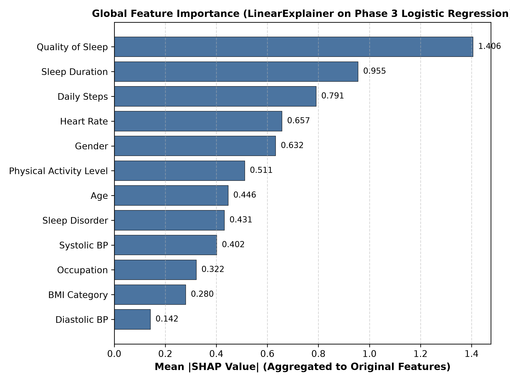
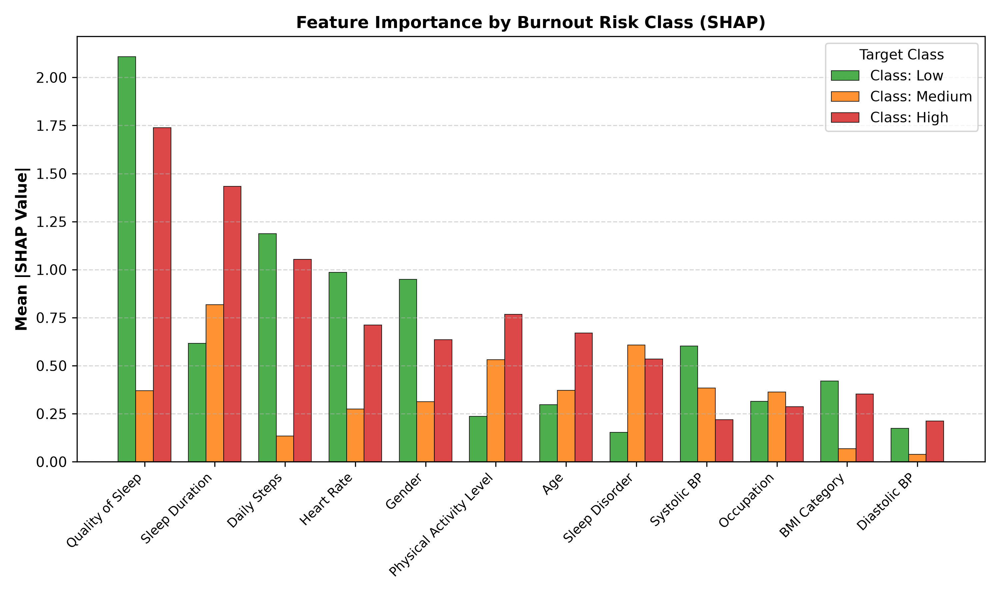
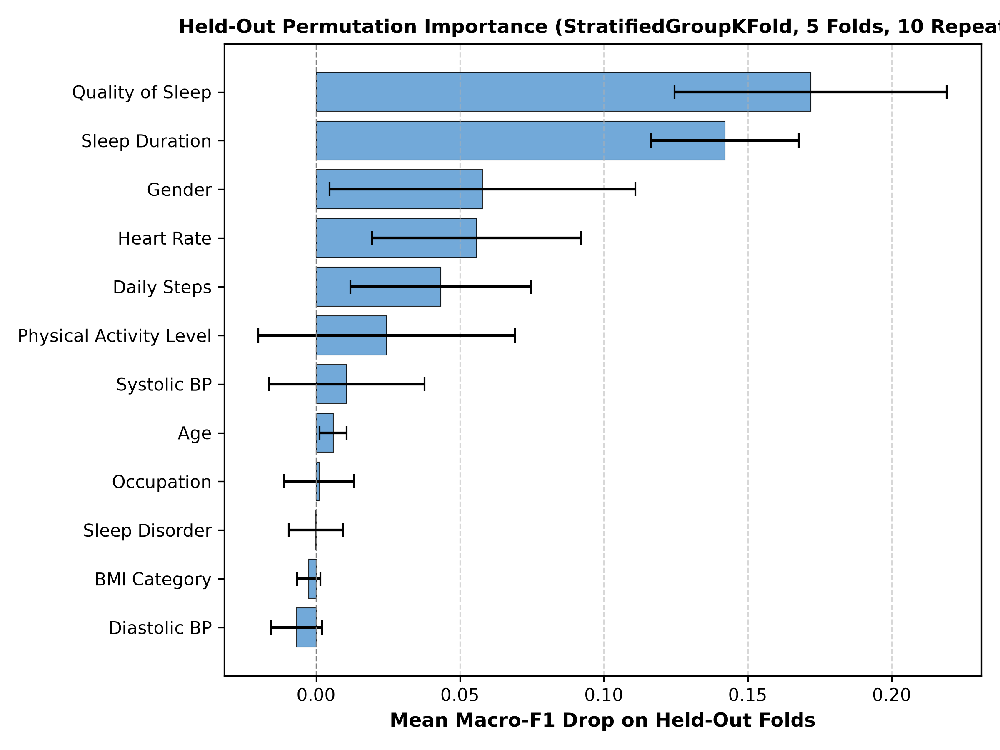
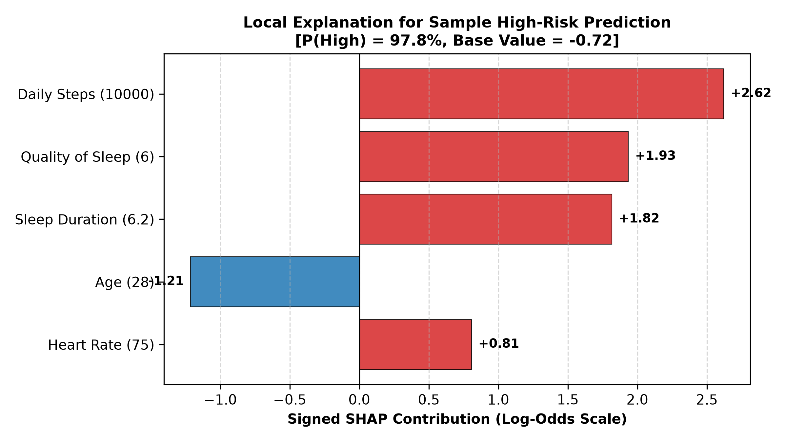

# BurnoutLens Phase 5: Model Explainability Report

## 1. Executive Summary & Setup

This report provides global and local model explainability for the selected Phase 3 supervised model: **Logistic Regression** within a scikit-learn Pipeline (`build_preprocessor()` + `LogisticRegression(max_iter=1000, random_state=42)`).

### Analytical Guardrails & Scope:
1. **Model Interpretation, Not Etiological Causation**:
   Explanations describe how the model uses input features to form its decision output. They **do not prove causal mechanisms of clinical burnout**.
2. **Target Definition Context**:
   The `Burnout Risk` ground truth is derived deterministically from self-reported `Stress Level` (Low: 1–4, Medium: 5–6, High: 7–10). Explanations highlight variables that correlate strongly with this self-reported stress rule.
3. **Additive Multiclass Formulation**:
   The multiclass model uses a one-vs-rest / multinomial log-odds scale (`decision_function`). SHAP explanations are computed via `shap.LinearExplainer` using an interventional background of the **132 unique-profile rows** (eliminating repeated duplicate weighting).
4. **Exact Feature Aggregation**:
   The 27 one-hot transformed columns are linearly collapsed into the 12 original features by summing their signed SHAP contributions, strictly preserving additivity:
   $$\sum_{i \in \text{transformed}(f)} \phi_i = \phi_f$$

### Installed Package Versions & Output Shapes:
- **`shap` Version**: `0.52.0`
- **`xgboost` Version**: `3.4.1`
- **Transformed Feature Matrix Shape**: `(374, 27)`
- **Background Shape**: `(132, 27)` (132 unique profiles)
- **`shap.LinearExplainer` Output Values Shape**: `(374, 27, 3)` (374 samples, 27 transformed features, 3 classes)
- **SHAP Decision Scale**: `decision_function` (log-odds scale; decision output matches base value + sum of SHAP values within $10^{-14}$ numerical tolerance)

---

## 2. Global Explanations: Model Coefficients

The Logistic Regression classifier fits independent linear equations for each class. Below are the top 10 transformed features by absolute coefficient value per class:

### Top 10 Coefficients per Class:

| Rank | Class: Low Risk (Base Intercept: 0.35) | Class: Medium Risk (Base Intercept: 0.74) | Class: High Risk (Base Intercept: -1.09) |
|:---:|:---|:---|:---|
| 1 | `Quality of Sleep`: **+2.4351** | `Occupation_Lawyer`: **+0.9844** | `Quality of Sleep`: **-2.0070** |
| 2 | `Daily Steps`: **-1.4195** | `Sleep Duration`: **+0.9323** | `Sleep Duration`: **-1.6346** |
| 3 | `Heart Rate`: **-1.2144** | `Sleep Disorder_None`: **+0.8248** | `Daily Steps`: **+1.2597** |
| 4 | `Gender_Female`: **+0.9536** | `Sleep Disorder_Sleep Apnea`: **-0.7558** | `Physical Activity Level`: **-0.8927** |
| 5 | `Gender_Male`: **-0.9442** | `Occupation_Engineer`: **-0.6849** | `Heart Rate`: **+0.8773** |
| 6 | `BMI Category_Normal`: **-0.7475** | `Physical Activity Level`: **+0.6176** | `Age`: **+0.8002** |
| 7 | `Systolic BP`: **-0.7316** | `Occupation_Doctor`: **-0.5331** | `Sleep Disorder_None`: **-0.7305** |
| 8 | `Sleep Duration`: **+0.7024** | `Occupation_Salesperson`: **-0.5304** | `Gender_Female`: **-0.6435** |
| 9 | `BMI Category_Obese`: **+0.6954** | `Occupation_Scientist`: **+0.5035** | `Gender_Male`: **+0.6280** |
| 10 | `Occupation_Lawyer`: **-0.6887** | `Systolic BP`: **+0.4658** | `Occupation_Accountant`: **+0.5541** |

### Key Coefficient Insights:
- **Low Risk**: Strongly driven by higher `Quality of Sleep` (+2.435) and female gender (+0.954), contrasted against elevated `Daily Steps` (-1.420) and `Heart Rate` (-1.214).
- **Medium Risk**: Dominated by occupation and baseline stability (`Occupation_Lawyer` +0.984, `Sleep Duration` +0.932, `Sleep Disorder_None` +0.825).
- **High Risk**: Heavily penalized by lower `Quality of Sleep` (-2.007) and shorter `Sleep Duration` (-1.635), and driven higher by `Daily Steps` (+1.260), `Heart Rate` (+0.877), and `Age` (+0.800).

---

## 3. Global SHAP Importance (Aggregated to 12 Original Features)

SHAP values were computed across all 374 rows using `shap.LinearExplainer` and aggregated to the 12 original features.

### Overall & Class-Specific SHAP Importance Table:

| Rank | Feature | Mean |SHAP| (Overall) | Mean |SHAP| (Low) | Mean |SHAP| (Medium) | Mean |SHAP| (High) | Dominant Impact |
|:---:|:---|:---:|:---:|:---:|:---:|:---|
| 1 | **Quality of Sleep** | **1.4057** | 2.1086 | 0.3707 | 1.7379 | Low/High Sleep Separation |
| 2 | **Sleep Duration** | **0.9553** | 0.6157 | 0.8173 | 1.4330 | Low/High Sleep Separation |
| 3 | **Daily Steps** | **0.7911** | 1.1867 | 0.1336 | 1.0530 | Cardiovascular Strain |
| 4 | **Heart Rate** | **0.6573** | 0.9860 | 0.2737 | 0.7123 | Cardiovascular Strain |
| 5 | **Gender** | **0.6325** | 0.9487 | 0.3131 | 0.6357 | Demographic/Baseline |
| 6 | **Physical Activity Level** | **0.5113** | 0.2363 | 0.5306 | 0.7669 | Demographic/Baseline |
| 7 | **Age** | **0.4464** | 0.2973 | 0.3723 | 0.6696 | Demographic/Baseline |
| 8 | **Sleep Disorder** | **0.4314** | 0.1526 | 0.6073 | 0.5344 | Demographic/Baseline |
| 9 | **Systolic BP** | **0.4015** | 0.6023 | 0.3834 | 0.2189 | Demographic/Baseline |
| 10 | **Occupation** | **0.3216** | 0.3147 | 0.3632 | 0.2868 | Demographic/Baseline |
| 11 | **BMI Category** | **0.2800** | 0.4200 | 0.0673 | 0.3527 | Demographic/Baseline |
| 12 | **Diastolic BP** | **0.1416** | 0.1746 | 0.0378 | 0.2124 | Demographic/Baseline |




---

## 4. Held-Out Cross-Check: Permutation Importance

To confirm that SHAP importance is not an artifact of in-sample collinearity, we computed **held-out permutation importance** across validation folds using 5-fold `StratifiedGroupKFold` (`groups=dup_group`, 10 repeats, scoring: `macro-F1`). Features were permuted in their original form prior to the pipeline.

### Permutation Importance Table:

| Rank | Feature | Mean Macro-F1 Drop | Std Dev | Stability Across Folds |
|:---:|:---|:---:|:---:|:---|
| 1 | **Quality of Sleep** | **+0.1719** | 0.0473 | High impact |
| 2 | **Sleep Duration** | **+0.1421** | 0.0256 | High impact |
| 3 | **Gender** | **+0.0578** | 0.0531 | High impact |
| 4 | **Heart Rate** | **+0.0558** | 0.0362 | High impact |
| 5 | **Daily Steps** | **+0.0433** | 0.0314 | Moderate impact |
| 6 | **Physical Activity Level** | **+0.0245** | 0.0446 | Moderate impact |
| 7 | **Systolic BP** | **+0.0107** | 0.0270 | Moderate impact |
| 8 | **Age** | **+0.0059** | 0.0048 | Low / negligible |
| 9 | **Occupation** | **+0.0010** | 0.0122 | Low / negligible |
| 10 | **Sleep Disorder** | **-0.0001** | 0.0094 | Low / negligible |
| 11 | **BMI Category** | **-0.0025** | 0.0040 | Low / negligible |
| 12 | **Diastolic BP** | **-0.0067** | 0.0089 | Low / negligible |



### Correlation Between SHAP and Permutation Importance:
- **Spearman Rank Correlation ($\rho$)**: **0.9371**
- **$p$-value**: **6.9932e-06**
- **Finding**: Extreme agreement ($> 0.93$) between in-sample SHAP values and out-of-fold generalization drops. Both methods identify **`Quality of Sleep`** and **`Sleep Duration`** as the two dominant predictors.

---

## 5. Tree Cross-Check: XGBoost Comparison

We evaluated feature importance on the Phase 3 XGBoost baseline using `shap.TreeExplainer` to check whether ranking generalizes across model families.

### SHAP / XGBoost Interventional Background Issue:
When initializing `shap.TreeExplainer(model, data=X_unique_trans)` on XGBoost 3.4.1 / SHAP 0.52.0, the following error occurred:
```text
NotImplementedError: Categorical split is not yet supported. You can still use TreeExplainer with `feature_perturbation=tree_path_dependent`.
```
**Version-Aware Fix**:
`shap.TreeExplainer` in version 0.52.0 disallows interventional background data when trees contain categorical splits or certain split encodings. To resolve this, we configured `feature_perturbation="tree_path_dependent"`, which executes TreeSHAP via path tracing across tree leaves.

### XGBoost SHAP Ranking vs. Logistic Regression SHAP Ranking:

| Rank | Logistic Regression SHAP | XGBoost SHAP (TreeExplainer) |
|:---:|:---|:---|
| 1 | Quality of Sleep (1.406) | Quality of Sleep (1.243) |
| 2 | Sleep Duration (0.955) | Heart Rate (0.939) |
| 3 | Daily Steps (0.791) | Sleep Duration (0.766) |
| 4 | Heart Rate (0.657) | Gender (0.359) |
| 5 | Gender (0.632) | Daily Steps (0.317) |
| 6 | Physical Activity Level (0.511) | Occupation (0.280) |
| 7 | Age (0.446) | Physical Activity Level (0.259) |
| 8 | Sleep Disorder (0.431) | Sleep Disorder (0.243) |
| 9 | Systolic BP (0.402) | Diastolic BP (0.192) |
| 10 | Occupation (0.322) | Age (0.079) |
| 11 | BMI Category (0.280) | Systolic BP (0.078) |
| 12 | Diastolic BP (0.142) | BMI Category (0.039) |

- **Spearman Rank Correlation (LR vs. XGBoost SHAP)**: **0.8252** ($p=9.5136e-04$).
- **Finding**: Strong concordance ($\rho = 0.8252$). Both models place sleep parameters (`Quality of Sleep`, `Sleep Duration`) and autonomic metrics (`Heart Rate`, `Daily Steps`, `Gender`) at the top of feature hierarchies.

---

## 6. Local Explanations: 3 Worked Examples

We applied `explain_row()` to 3 real dataset records representing Low, Medium, and High predicted risk states.

### Example 1: Predicted LOW Burnout Risk
- **Input Profile**: Age: 44, Gender: Female, Occupation: Accountant, Sleep: 7.9h, Sleep Quality: 8/10, Heart Rate: 69 bpm, BP: 117/76 mmHg.
- **Predicted Class**: **Low** (Probability: **92.3%**)
- **Base Value (Log-Odds)**: -0.3873
- **Top 5 Contributing Features**:
  - `Quality of Sleep` = `8` -> **+1.7284** (pushes toward Low)
  - `Systolic BP` = `117` -> **+1.0745** (pushes toward Low)
  - `Gender` = `Female` -> **+0.9633** (pushes toward Low)
  - `Sleep Duration` = `7.9` -> **+0.7226** (pushes toward Low)
  - `Heart Rate` = `69` -> **+0.6482** (pushes toward Low)

### Example 2: Predicted MEDIUM Burnout Risk
- **Input Profile**: Age: 27, Gender: Male, Occupation: Software Engineer, Sleep: 6.1h, Sleep Quality: 6/10, Physical Activity: 42m, Steps: 4200, BP: 126/83 mmHg.
- **Predicted Class**: **Medium** (Probability: **69.2%**)
- **Base Value (Log-Odds)**: 1.1094
- **Top 5 Contributing Features**:
  - `Sleep Duration` = `6.1` -> **-1.1528** (pushes away)
  - `Age` = `27` -> **+0.7258** (pushes toward Medium)
  - `Occupation` = `Software Engineer` -> **+0.6215** (pushes toward Medium)
  - `Sleep Disorder` = `None` -> **+0.5543** (pushes toward Medium)
  - `Physical Activity Level` = `42` -> **-0.4867** (pushes away)

### Example 3: Predicted HIGH Burnout Risk
- **Input Profile**: Age: 28, Gender: Female, Occupation: Nurse, Sleep: 6.2h, Sleep Quality: 6/10, Physical Activity: 90m, Steps: 10000, Heart Rate: 75 bpm, BP: 140/95 mmHg.
- **Predicted Class**: **High** (Probability: **97.8%**)
- **Base Value (Log-Odds)**: -0.7221
- **Top 5 Contributing Features**:
  - `Daily Steps` = `10000` -> **+2.6212** (pushes toward High)
  - `Quality of Sleep` = `6` -> **+1.9334** (pushes toward High)
  - `Sleep Duration` = `6.2` -> **+1.8156** (pushes toward High)
  - `Age` = `28` -> **-1.2130** (pushes away)
  - `Heart Rate` = `75` -> **+0.8062** (pushes toward High)



---

## 7. Analytical Limitations

1. **Model Explanations vs. Biological Causality**:
   SHAP values isolate statistical feature utility within the linear decision boundary of this specific classifier. They do not demonstrate that altering a single variable (e.g., increasing sleep by 1 hour) will causally cure or prevent burnout.
2. **Target Derived from Self-Reported Stress**:
   Because `Burnout Risk` is deterministically mapped from `Stress Level` (1–10), the model is essentially predicting self-reported psychological stress.
3. **Sleep Quality as a Bidirectional Proxy**:
   `Quality of Sleep` and `Sleep Duration` act as the strongest predictors. In cross-sectional survey data, poor sleep quality may be both a contributor to and a direct symptom of occupational stress.
4. **Duplicate Cohorts in Training Distribution**:
   While the SHAP background set was restricted to the 132 unique profiles to avoid bias, the training weights of the model itself reflect the full 374-row distribution, which overweights repeated worker profiles.
5. **Not Medical Advice**:
   Explanations provide descriptive algorithmic transparency for engineering review and future wellness UI visualization. They must never be used as diagnostic or clinical advice.
